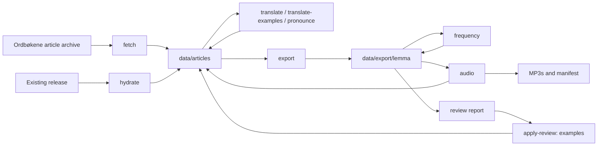

# Norsk Lemma

A Norwegian Bokmål lexicon for language-learning applications: dictionary senses
with English glosses and examples, inflected word forms, IPA and pitch accent,
frequency ranks, and generated pronunciation audio. The Python pipeline turns
[Bokmålsordboka / Ordbøkene](https://ordbokene.no) articles into JSON files for
import into an application.

**Bokmål only; Nynorsk is not included.** To consume the existing dataset, start
with `data/export/lemma/` and the [schema reference](docs/schema.md). Running the
pipeline is only necessary to rebuild or enrich it. Audio files are distributed
separately from Git.

## Dataset coverage

Measured from the local export on **2026-09-08**, at repository revision
`eeebd49122`:

| Measure | Count |
| --- | ---: |
| Exported article files | 96,459 |
| Lemma entries | 109,136 |
| Lemmas with a nonempty English headword gloss | 98,943 |
| Definitions with English glosses | 131,705 / 143,369 |
| Examples with English translations | 85,131 / 85,176 |
| Word forms with IPA | 419,772 / 430,830 |
| Lemmas with audio metadata | 97,154 |
| Lemmas with Kelly frequency ranks | 6,201 |

These are field-presence counts, not accuracy scores or confirmation that remote
audio URLs are available. One article can contain multiple lemma entries.
The upstream archive, model responses, and TTS output can change; a fresh build
is not guaranteed to reproduce this snapshot. Record the source snapshot,
revision, model, pronunciation resources, and release tag when comparing runs.

## How the pipeline works

The article cache is the working source of truth. Translation, example
translation, pronunciation, and audio metadata are embedded there; export
produces the application payload. Frequency ranking is applied after export.



| Command | Role |
| --- | --- |
| `fetch` | Download the Bokmål archive when the article directory is empty. |
| `hydrate` | Download a release and reuse its translations in source articles. |
| `translate` | Translate dictionary definitions and concise headword meanings via an LLM. |
| `translate-examples` | Backfill example translations without regenerating sense glosses. |
| `pronounce` | Add IPA and pitch accent using NB Uttale, its additions, then `nb-g2p`. |
| `export` | Build lemma JSON from articles with embedded translations. |
| `frequency` | Match the vendored Kelly list to exported lemma/POS pairs. |
| `review` | Ask an LLM to inspect exported translations and report issues. |
| `apply-review` | Apply supported example-translation suggestions to articles. |
| `audio` | Generate lemma MP3s and embed their metadata into articles. |
| `build` | Run fetch → translate → pronounce → export → frequency. |

`build` does not run the separate example backfill, review, or audio stages.

## Quick start

Run commands from the repository root. You need **Python 3.12+** and
[uv](https://docs.astral.sh/uv/). The shell examples use Bash.

```bash
uv sync
uv run python pipeline.py --help
```

For LLM work, copy `.env.example` to `.env` if you do not already have one, then
set `OPENROUTER_API_KEY`. Existing exports can be read without credentials.

Before running `pronounce` or `build`, download and extract both NB Uttale
packages using [data/README.md](data/README.md). The default files must be at:

```text
data/nb_uttale_leksika/nb_uttale_leksika/e_written_pronunciation_lexicon.csv
data/nb_uttale_tillegg/nb_uttale_tillegg/newwords_2022.csv
```

Use `--leksika` and `--newwords` to supply alternate paths. The `nb-g2p`
dependency supplies the model fallback; its native runtime must work on the
machine used for enrichment.

### Build new translations

First inspect pending work, then run a small paid sample:

```bash
uv run python pipeline.py fetch
uv run python pipeline.py translate --dry-run
uv run python pipeline.py translate --limit 20 --batch-size 15
uv run python pipeline.py build
```

The final command continues translation and runs pronunciation, export, and
frequency ranking. Export refreshes changed payloads and leaves identical
files untouched.

### Hydrate from a release and rebuild

Hydration avoids LLM calls. By default it downloads the latest release from
`Chalvin96/norsk-lemma`; use `--tag` to select a published version. It selects
the exact `norsk-lemma-{tag}.tar.gz` asset and rejects releases without that
exactly tagged archive. It imports numeric JSON files from `lemma/`
directories after checking that each is an object with a `lemmas` array. This
is a basic structure check, not full schema validation.

```bash
uv run python pipeline.py fetch
uv run python pipeline.py hydrate
uv run python pipeline.py pronounce
uv run python pipeline.py export
uv run python pipeline.py frequency
```

Hydration validates the release in a staging directory, then swaps it into
`--lemma-dir`; an existing export remains available if download, validation, or
installation fails. The swap completes before article hydration, and `--limit`
applies only to that article step. Use a separate directory if you need to
retain a local export. Existing article translations are skipped unless
`--force` is supplied. Hydration restores headword glosses, definition glosses,
and example translations. It matches definitions and examples by Norwegian text,
using occurrence order when duplicate texts occur. Use a compatible article
snapshot: changed Norwegian text cannot be matched automatically. Hydration does
not install MP3s or restore audio metadata into
articles. Keep a local audio manifest and use `audio --enrich-only` before
exporting if you need to restore that metadata.

For articles already enriched locally, the rebuild requires no model calls:

```bash
uv run python pipeline.py export
uv run python pipeline.py frequency
```

`export` rebuilds payloads from translated articles and writes only changed
files; `--force` also rewrites identical files. Existing frequency fields are
preserved when the source lemma ID, spelling, homograph number, and POS match.
Run `frequency` to calculate ranks for new or changed entries and refresh the
match report. Audio survives a rebuild when it is present in the article cache;
export alone cannot recover audio metadata that exists only in an older export.
Export does not remove old files for articles that are now absent or skipped;
check for stale files when changing source snapshots.

### Translate examples and review

```bash
uv run python pipeline.py translate-examples --dry-run --limit 20
uv run python pipeline.py translate-examples --limit 20
uv run python pipeline.py export
uv run python pipeline.py frequency

uv run python pipeline.py review --limit 100 --dry-run
uv run python pipeline.py review --limit 100 --output translation-review.json
```

Example backfill skips completed examples by default and supports bounded
concurrency via `--workers`. Review inspects headword glosses, definitions, and
examples; it writes an issues report and does not modify the dataset.

Inspect the report before applying its example fixes:

```bash
uv run python pipeline.py apply-review --review translation-review.json --dry-run
uv run python pipeline.py apply-review --review translation-review.json
uv run python pipeline.py export
uv run python pipeline.py frequency
```

Only issue paths of the form `definitions[N].examples[M].en` are applied.
The default severity threshold is `medium`; `--severity-threshold` also accepts
`low` and `high`. Headword and definition-gloss findings need separate edits
to the article translations.

### Pronunciation and frequency

```bash
uv run python pipeline.py pronounce --workers 8
uv run python pipeline.py export
uv run python pipeline.py frequency --dry-run
uv run python pipeline.py frequency
```

Pronunciation uses East Norwegian NB Uttale data. Pitch accent is stored in
`tone` separately from the IPA string. Fallback model entries carry
`needs_review: true` and `prosody_trusted: false`. Multiword expressions and
bracket alternatives are not sent to the fallback model.

Kelly ranks are a limited vocabulary-list signal, not a rank for every word or
a CEFR level. Homographs can share a rank and receive
`frequency_ambiguous: true`. The default match report is
`data/vendor/kelly/match-report.json`; use `--report` or `--kelly-csv` to
override paths. See [pronunciation details](docs/pronunciation-pipeline.md) and
[Kelly provenance](data/vendor/kelly/README.md).

### Generate and restore audio metadata

Install the audio dependency group and configure Google Application Default
Credentials, for example through a service-account credential file:

```bash
export GOOGLE_APPLICATION_CREDENTIALS=/path/to/service-account.json
uv run --group audio python pipeline.py audio --dry-run
uv run --group audio python pipeline.py audio --limit 20
```

The default voice is `nb-NO-Chirp3-HD-Aoede`. Unbounded synthesis requires
`--confirm-cost`:

```bash
uv run --group audio python pipeline.py audio --confirm-cost
uv run python pipeline.py export
uv run python pipeline.py frequency
```

The estimate uses the configured `--price-per-million-chars` rate, defaulting
to 30 USD; it is not a live billing quote. MP3s go to
`data/export/audio/lemma/google/{voice}/`, and
`manifest-google-{voice}.json` records file locations and SHA-256 checksums.
Generation writes metadata to articles; the following export makes it available
to consumers.

To embed metadata from an existing local manifest without synthesizing audio,
preview with `audio --enrich-only --dry-run`, then run:

```bash
uv run --group audio python pipeline.py audio --enrich-only
uv run python pipeline.py export
uv run python pipeline.py frequency
```

Keep the article cache, MP3s, and manifest together. Filenames hash synthesis
parameters; `content_sha256` hashes the actual MP3 bytes. Regenerating with
identical parameters can produce different bytes at the same filename.
Tone metadata does not guarantee that TTS pronounced the intended pitch accent.

Each synthesis run merges completed jobs with valid entries from the existing
manifest. Limited or resumed runs and runs with no pending jobs retain those
entries; missing, empty, or checksum-invalid files are regenerated. The
`--enrich-only` mode reads the existing manifest without regenerating audio.

## Configuration and reruns

Defaults live in [settings.py](scripts/ordbokene/settings.py); the CLI loads
the root `.env`. Use `pipeline.py <command> --help` for each stage's flags.

| Setting | Default / requirement |
| --- | --- |
| Translation model | `google/gemini-2.5-flash-lite`, overridden with `--model`. |
| Review model | `openai/gpt-5.4`, overridden with `--review-model`. |
| LLM transport | `openrouter`, requiring `OPENROUTER_API_KEY`. |
| CLI transports | `translate`, `review`, and `build` accept `--harness codex/claude/opencode/droid/pi`; install and authenticate the chosen CLI and choose a compatible model ID. |
| Example transport | `translate-examples` uses `--provider openrouter` or `--provider codex`, not `--harness`. |
| Input/output roots | `--articles-dir`, `--lemma-dir`; audio also accepts `--audio-dir`. |
| Translation failure log | `error_openrouter.log` by default for the main translate stage. |
| Object storage | `S3_ENDPOINT_URL`, `S3_BUCKET`, `S3_ACCESS_KEY_ID`, `S3_SECRET_ACCESS_KEY`; optional `S3_REGION` and `S3_OBJECT_ACL`. |

Rerun behavior is stage-specific. Translation skips articles with existing
translation data, pronunciation skips completed enrichment, export skips
unchanged payloads, and audio skips existing MP3s. These checks do not establish
that the data is complete or correct.

`--force` is also stage-specific: **`fetch --force` clears cached article JSON,
including local enrichments**. Do not use `build --force` merely to refresh an
export, because it passes force to fetch as well. Use `export` instead.

Dry runs for `fetch`, `translate`, `hydrate`, and `build` do not download
source or release archives. They inspect local data only, so an empty cache
cannot give a full pending-work estimate; `hydrate --dry-run` also requires
a lemma directory containing JSON files. Export dry-run counts source
articles before checking translation availability or unchanged payloads; its
count is not the number of files that would actually be written.
`audio --enrich-only --dry-run` previews manifest embedding without writing
articles. Limit semantics vary by command and are not a global build budget.

## Outputs and schema

```text
pipeline.py                       CLI entry point
scripts/ordbokene/                Extraction, translation, export, review, audio helpers
scripts/test_*.py                 Regression tests
data/articles/{id}.json           Mutable article cache; ignored by Git
data/export/lemma/{id}.json       Tracked application payload
data/export/audio/               Local MP3s and manifests; ignored by Git
data/vendor/kelly/               Tracked frequency source, provenance, report
docs/                            Schema and source/pipeline documentation
```

Each exported JSON object has `source_article_id`, `lemmas`, `definitions`,
and cross-reference fields. Lemmas carry source IDs, text, POS, homograph and
sub-article information, a nullable `primary_translation`, and `word_forms`.
Word forms carry morphology in `tags_json` plus pronunciation records.

Definitions contain Norwegian `text`, English `translation`, and all source
`{ "no", "en" }` example pairs.
Missing English examples use an empty string. Entries without a source meaning,
including pure cross-references, can have no headword gloss. Frequency and audio
fields are enrichments and may be missing in intermediate exports.

The [schema reference](docs/schema.md) describes both JSON layers, the
example pairs, and the article-first audio workflow. Use
`pipeline.py <command> --help` for the command-line reference.

## Audio hosting and releases

The uploader reads the manifest, resolves MP3s under `data/export/{path}`,
and uploads missing objects to an S3-compatible store:

```bash
uv run --group audio python scripts/upload_audio.py --dry-run
uv run --group audio python scripts/upload_audio.py
```

Use `--manifest` for another voice's manifest. Consumers can use each audio
entry's `url`, or join its host-free `path` to their own media host. Locally,
resolve `path` relative to `data/export/`; in release archives it resolves
relative to the archive root. The public base URL is currently defined by
`AUDIO_BASE_URL` in [audio.py](scripts/ordbokene/audio.py), not by the S3 endpoint.
Public playback requires public-read object access. Uploader dry-run checks
local files only; it does not query which objects already exist remotely.

Release from the machine that holds the MP3s, after rebuilding, checking the
dataset, and committing the intended files. Install and authenticate
[GitHub CLI](https://cli.github.com/) first.

```bash
scripts/release.sh vX.Y.Z
```

Replace `vX.Y.Z` with a new numeric version tag. **This command publishes a
GitHub release at HEAD**; it is not an archive-only preview. It requires the
local audio directory, rejects an existing tag, and normally rejects tracked
changes. It creates two files in `dist/release/`:

| Archive | Contents |
| --- | --- |
| `norsk-lemma-{tag}.tar.gz` | `README.md`, `lemma/`, and `audio/lemma/`. |
| `norsk-lemma-audio-google-{tag}.tar.gz` | `README.md` and `audio/`, including manifests. |

The script does not run tests or dataset validation. Archive the paid TTS
output because later synthesis may not reproduce it.

## Validation and maintenance

```bash
uv sync --dev
uv run pytest scripts/
uv run ruff check scripts/ pipeline.py
```

Tests exercise translation parsing, example alignment, morphology,
cross-references, frequency matching, and audio round trips using fixtures.
They do not certify the entire dataset or verify live LLM, TTS, storage, or
GitHub release integrations. Before a release, also inspect the export diff,
frequency match report, representative glosses/pronunciations,
and manifest-to-file integrity and playback. Record coverage against the same
source snapshot. There is currently no repository CI workflow enforcing
dataset-wide schema or coverage gates.

Useful next steps are automated dataset validation and coverage regression
checks, plus a curated evaluation set for translations and pronunciation.
These are maintenance goals, not existing pipeline guarantees.

## Licensing and attribution

- **Code:** [Apache-2.0](LICENSE); preserve [NOTICE](NOTICE).
- **Dictionary and derived dictionary data:** Bokmålsordboka/Nynorskordboka,
  Universitetet i Bergen og Språkrådet, ordbøkene.no; CC BY 4.0.
- **Pronunciation lexica:** NB Uttale, Nasjonalbiblioteket / Språkbanken;
  CC0 1.0. Model fallback provenance is recorded separately as `nb_g2p`.
- **Kelly frequency source:** Universitetet i Oslo, Tekstlaboratoriet;
  CC BY-SA 4.0. Preserve its separate attribution and share-alike terms.
- **Audio:** generated by Google Cloud Text-to-Speech; subject to the provider's
  terms. English translations are model-generated, not upstream dictionary text.

See [data sources](docs/data-sources.md), [Kelly provenance](data/vendor/kelly/README.md),
and [NOTICE](NOTICE) for attribution details. The code license does not replace
the source datasets' terms.

This is an assisted lexicon, not a fully human-reviewed bilingual dictionary.
Gloss coverage is incomplete, model translations and fallback IPA need review,
the pronunciation selection represents East Norwegian rather than all dialects,
and frequency and TTS tone metadata have the limitations described above.


### Definition translation and recovery

The existing extractor prepares compact, entry-aware source packets; the client
validates and caches responses; the prompt defines dictionary fidelity and the
strict response schema. Expressions use complete definition translations, with
optional ` (lit. …)` imagery after the complete definition. Primary translations
are concise, grammatical dictionary meanings or conventional equivalents, with
necessary articles and prepositions; telegraphic mnemonic wording is excluded. No product fields or expression-only stage are added.

`translate` and `scripts/translate.py` default to `--batch-size 15`. Successful
records are atomically cached before output writes in `data/cache/translations/`
(or `--cache-dir PATH`), keyed by source/prompt content, pipeline version and model
settings. Reruns retry only missing/failed records. `--force` reprocesses existing
outputs while reusing valid cache; use a new cache directory for fresh model output.
After source edits on translated articles, use `--force` to apply the new fingerprint.
Cache files remain untracked working state.

Strict JSON, exact ordered source IDs/cardinality, nonblank meanings and no extra
fields are required. Bare semantic references resolve an explicit target sense, or a target with exactly
one extracted definition when its sense ID is absent. Typed contrast, opposite and
abbreviation metadata remain lexical context. A selected target's local definition
text is accepted without following supplementary aliases; reference-only chains
retain their article/sense provenance and stop at cycles or eight hops. Explicit
sub-definition IDs are supported only when they contain a definition. Multi-target,
missing, empty and unprovable targets fail with cause and target IDs. Referenced
examples are never imported. Records without substantive source definitions,
missing source examples and visibly literal-only meanings fail before model output
is accepted. These checks
cannot establish subtle semantic equivalence; linguistic review remains necessary.

Embedding and export share one checked merge: no blank overwrites or silently
padded mismatches. All source examples and existing English survive regeneration;
`translate-examples` translates missing English separately. Hydration matches each
Norwegian example's text rather than copying English by position.


To regenerate a reviewed subset without removing referenced articles from the
source directory, use a JSON array of article IDs:

```bash
python pipeline.py translate --articles-dir SOURCE --article-ids-file selected-ids.json --force --batch-size 15 --model MODEL --harness HARNESS
```

The ID selection applies before batching and rejects missing IDs. `--force` makes
previously translated selected records eligible; successful cached results are
still reused. Failed records leave existing content intact, which is not an
endorsement of old translations: withhold independently identified contaminated
records until a verified replacement is available. Example translation remains a
separate stage. Resolver provenance is prompt/cache metadata, not a product field.
