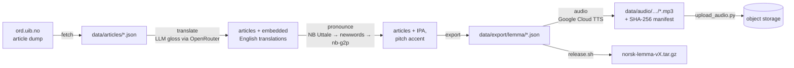

# Norsk Lemma

An LLM-assisted Norwegian lexicon pipeline built from [Ordbokene](https://ordbokene.no) open data.
Turns the Bokmålsordboka article dump into normalized lemma JSON with English glosses and TTS audio,
ready for import into [Flyt](https://github.com/Chalvin/flyt).

> Bokmål only. Nynorsk not included.

---

## Dataset at a Glance

Measured over the current export (`data/export/lemma/`, 2026-07-03):

| Metric | Value |
|---|---|
| Source articles | 96,459 |
| Lemmas | 109,136 |
| Lemmas with English gloss | 98,704 (90.4%) |
| Definitions translated | 131,705 / 143,369 (91.9%) |
| Word forms | 430,830 |
| Word forms with IPA | 419,772 (97.4%) |
| Pronunciations with known pitch accent (tone 1/2) | 415,997 (99.1%) |
| Lemmas with TTS audio | 97,154 (89.0%) |
| Lemmas with frequency rank | 6,201 (Kelly list; 5,710 of 5,999 Kelly entries matched) |
| IPA provenance | NB Uttale 303,111 · nb-g2p fallback 116,661 |

---

## Pipeline



All stages run through one CLI:

| Stage | Command | Output |
|---|---|---|
| Fetch | `python pipeline.py fetch` | `data/articles/*.json` |
| LLM gloss | `python pipeline.py translate` | translations embedded into articles |
| Pronunciation (IPA + tone) | `python pipeline.py pronounce` | pronunciation fields in articles |
| Export | `python pipeline.py export` | `data/export/lemma/*.json` |
| Frequency rank | `python pipeline.py frequency` | `frequency_rank` field in `lemma/*.json` + match report |
| Review | `python pipeline.py review` | translation QA report |
| Audio (MP3) | `python pipeline.py audio` | `data/export/audio/lemma/google/{voice}/*.mp3` |
| Everything | `python pipeline.py build` | fetch → translate → pronounce → export |
| Release | `scripts/release.sh vX.Y.Z` | `norsk-lemma-vX.Y.Z.tar.gz` |

Every stage is idempotent: finished work is skipped on re-run, so the pipeline
is safe to interrupt and resume (`--force` rebuilds).

The `translate`, `review`, and `build` stages accept `--harness {openrouter,codex,claude,opencode,droid,pi}`
(default `openrouter`) to choose the transport — the OpenRouter HTTP API or a
locally-installed agentic CLI. See [`scripts/README.md`](scripts/README.md#harness-backends).

---

## Quick Start

```bash
uv sync
export OPENROUTER_API_KEY=sk-or-...
uv run python pipeline.py build
```

If `data/articles/` is empty, the pipeline downloads the Bokmålsordboka source archive automatically.

Preview pending work without API calls:

```bash
uv run python pipeline.py translate --limit 50 --dry-run
```

Review exported translations with a stronger model:

```bash
uv run python pipeline.py review --review-model openai/gpt-5.4 --limit 100 --output translation-review.json
```

### Pronunciation Enrichment

```bash
uv run python pipeline.py pronounce --workers 8
```

Lookup chain: **NB Uttale** → **NB Uttale newwords** → **nb-g2p fallback**.
See [`docs/pronunciation-pipeline.md`](docs/pronunciation-pipeline.md).

### Audio Generation

```bash
# Dry-run: estimate cost
uv run --group audio python pipeline.py audio --dry-run

# Generate all
uv run --group audio python pipeline.py audio \
  --voice nb-NO-Chirp3-HD-Aoede \
  --confirm-cost
```

Audio metadata is written into the exported lemma JSONs under `data/export/lemma/`.
MP3s go under `data/export/audio/lemma/google/{voice}/` with a SHA-256 manifest.
See [`docs/audio-strategy.md`](docs/audio-strategy.md).

---

## Repository Layout

```
pipeline.py              ← CLI entry point (fetch/translate/pronounce/export/audio/build)
data/
  articles/     ← raw Ordbokene articles (git-ignored, fetched on demand)
  export/
    lemma/      ← exported lemma JSONs (translations + IPA + audio fields, git-tracked)
    audio/
      lemma/google/{voice}/*.mp3   ← TTS audio files (git-ignored)
      manifest-google-{voice}.json ← file index with SHA-256 checksums
scripts/
  translate.py           ← compatibility wrapper
  ordbokene/             ← pipeline modules (client, extract, build, prompt, audio, …)
  enrich_pronunciation.py
  generate_audio.py
  upload_audio.py
  release.sh
docs/                    ← schema, data sources, audio strategy
```

---

## Output Schema

Each lemma JSON entry:

```json
{
  "source_article_id": 123,
  "lemmas": [
    {
      "lemma": "utepils",
      "primary_translation": "outdoor beer",
      "word_forms": [
        {
          "word_form": "utepils",
          "pronunciation": [
            {
              "ipa": "²uːtəpɪls",
              "tone": 2,
              "tone_status": "known",
              "source": "nb_uttale"
            }
          ]
        }
      ],
      "audio": {
        "lemma": [
          {
            "type": "tts",
            "provider": "google",
            "voice": "nb-NO-Chirp3-HD-Aoede",
            "file": "9e1c4b4f2a7d.mp3",
            "tone": 2
          }
        ]
      }
    }
  ],
  "definitions": [
    {
      "text": "ol som blir drukket ute i fint ver",
      "translation": "beer enjoyed outside in good weather",
      "examples": [
        {
          "no": "vi tok en utepils i solen",
          "en": "we had an outdoor beer in the sun"
        }
      ]
    }
  ]
}
```

Each definition carries up to two example sentences as `{ "no", "en" }` pairs:
the original Norwegian and its English translation, produced in the same LLM call
as the sense. Entries built from the reuse path (pre-example data) have `en: ""`
until backfilled.

Full field reference: [`docs/schema.md`](docs/schema.md).

---

## Audio Hosting

Audio (`data/export/audio/`) is gitignored — it stays out of git so the repo is light
to clone. The MP3s are served from object storage and streamed by the app on
demand.

```bash
uv run --group audio python scripts/upload_audio.py            # upload missing
uv run --group audio python scripts/upload_audio.py --dry-run  # preview
```

The uploader reads the audio manifest and pushes each clip to its manifest
`path`. The public URL is the media host + that path:

```
https://media.umebocchi.my.id/<path>
e.g. https://media.umebocchi.my.id/audio/lemma/google/{voice}/{file}.mp3
```

Each audio entry carries both `path` (host-free key) and `url` (ready-to-use
absolute URL); the manifest mirrors them. Use `url` directly, or join `path`
onto your own host. Keys are content-addressed and immutable, so they cache
forever.

Credentials: copy `.env.example` → `.env` and fill the `S3_*` keys. Only the
access/secret keys are secret; endpoint and bucket are public config. The
bucket must allow public reads (bucket policy, or set `S3_OBJECT_ACL=public-read`
for stores that support per-object ACLs) — otherwise the `url`s return 403.

### Cold backup

`scripts/release.sh vX.Y.Z` builds offline tarballs (lemma JSON + audio) and
attaches them to a GitHub release. Not the serving path — kept as an archival
backup of the paid, non-reproducible TTS audio.

---

## Development

```bash
uv sync --dev
uv run pytest scripts/
uv run ruff check
```

---

## Roadmap

- **CI quality gates** — schema validation and coverage-regression checks over the exported dataset on every push.
- **Eval harness** — deterministic data checks plus an LLM-judge pass on a curated golden set, with committed eval reports per gloss model.
- **Frequency & difficulty data** — corpus-derived frequency ranks and heuristic difficulty tiers per lemma.

---

## Attribution

**Dictionary data** — Bokmålsordboka/Nynorskordboka, Universitetet i Bergen og Språkrådet, [ordbøkene.no](https://ordbokene.no), **CC BY 4.0**.

**Pronunciation data** — NB Uttale (Nasjonalbiblioteket / Språkbanken), **CC0 1.0**.

**Audio** — Generated by Google Cloud Text-to-Speech, `nb-NO-Chirp3-HD-Aoede`.

Full attribution: [`docs/data-sources.md`](docs/data-sources.md) · License: [`LICENSE`](LICENSE) · [`NOTICE`](NOTICE)

> The source dictionary data in `data/articles/` and derived data in `data/export/lemma/`
> remain subject to the Ordbokene attribution and CC BY 4.0 terms.
